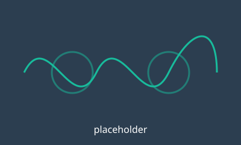

TODO: replace this page with a real visualisation. Things that work here:

- **Images and figures**: ``
- **Videos**: `{}` or a YouTube link
- **Maths**: $\partial_t \omega + \mathbf{u}\cdot\nabla\omega = \nu\nabla^2\omega + f$
- **Computed plots**: Python or Julia code cells (matplotlib, plotly, …).
  Render once on your own machine; results are cached in `_freeze/`, so the
  website build does not need your simulation environment.

{width=60%}
